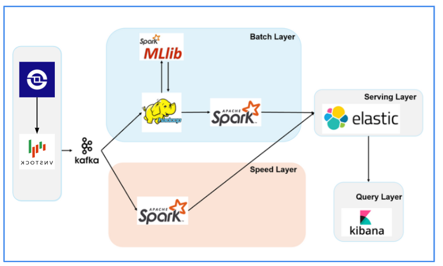

# Dự án Thu thập và Phân tích Dữ liệu Chứng khoán Việt Nam

Pipeline:   


## 📋 Giới thiệu
Dự án sử dụng thư viện **vnstock3** để thu thập dữ liệu chứng khoán từ thị trường Việt Nam, bao gồm:
- 📊 **OHLCV**: Dữ liệu giá lịch sử (Open, High, Low, Close, Volume)
- 📈 **Fundamental**: Báo cáo tài chính, chỉ số tài chính, thông tin công ty
- 📉 **Market**: Chỉ số thị trường (VN-Index, HNX-Index), danh sách cổ phiếu

## 🏗️ Cấu trúc thư mục
```
BTL_BigData/
├── config.py                          # File cấu hình (danh sách mã, tham số)
├── pipeline.py                        # Pipeline chính điều phối toàn bộ
├── historical_ohlcv_crawler.py        # Crawler dữ liệu OHLCV
├── fundamental_analyst_crawler.py     # Crawler dữ liệu fundamental
├── market_crawler.py                  # Crawler dữ liệu thị trường
├── save.py                            # Utilities lưu trữ dữ liệu
├── requirements.txt                   # Dependencies
├── data/                              # Thư mục chứa dữ liệu
│   ├── ohlcv/                        # Dữ liệu giá
│   ├── fundamental/                   # Dữ liệu tài chính
│   └── market/                        # Dữ liệu thị trường
└── logs/                              # Log files
```

## 🚀 Cài đặt

### 1. Clone repository
```bash
git clone <repository-url>
cd BTL_BigData
```

### 2. Tạo virtual environment (khuyến nghị)
```bash
python -m venv .venv
source .venv/bin/activate  # Linux/Mac
# hoặc
.venv\Scripts\activate     # Windows
```

### 3. Cài đặt dependencies
```bash
pip install -r requirements.txt
```

## 📖 Hướng dẫn sử dụng

### 1. Cấu hình
Chỉnh sửa `config.py` để thiết lập:
- Danh sách mã cổ phiếu cần crawl
- Khoảng thời gian
- Các loại dữ liệu cần thu thập

```python
# Ví dụ trong config.py
SYMBOLS = ['FPT', 'VNM', 'VCB', 'HPG', 'VHM']
START_DATE_3Y = '2022-01-01'
```

### 2. Chạy các crawler riêng lẻ

#### Thu thập dữ liệu OHLCV
```bash
python historical_ohlcv_crawler.py
```

#### Thu thập dữ liệu Fundamental
```bash
python fundamental_analyst_crawler.py
```

#### Thu thập dữ liệu Market
```bash
python market_crawler.py
```

### 3. Chạy toàn bộ pipeline
```bash
python pipeline.py
```

Pipeline sẽ tự động:
- Thu thập dữ liệu cho tất cả mã trong config
- Lưu vào các thư mục tương ứng
- Ghi log quá trình thực hiện
- Hiển thị tổng kết

## 📝 Chi tiết các module

### 1. `historical_ohlcv_crawler.py`
Thu thập dữ liệu giá lịch sử:
- Daily (1D), Weekly (1W), Monthly (1M)
- Intraday (dữ liệu trong ngày)

**Sử dụng:**
```python
from historical_ohlcv_crawler import HistoricalOHLCVCrawler

crawler = HistoricalOHLCVCrawler('FPT')
data = crawler.get_historical_data('2024-01-01', '2024-12-31', interval='1D')
crawler.save_data(data, 'FPT_daily.csv')
```

### 2. `fundamental_analyst_crawler.py`
Thu thập dữ liệu phân tích cơ bản:
- Thông tin công ty
- Báo cáo tài chính (BCĐKT, KQKD, LCTT)
- Chỉ số tài chính
- Lịch sử cổ tức

**Sử dụng:**
```python
from fundamental_analyst_crawler import FundamentalCrawler

crawler = FundamentalCrawler('FPT')
profile = crawler.get_company_profile()
balance_sheet = crawler.get_financial_report('BalanceSheet', 'year')
```

### 3. `market_crawler.py`
Thu thập dữ liệu thị trường:
- Chỉ số VN-Index, HNX-Index
- Danh sách tất cả mã cổ phiếu theo sàn

**Sử dụng:**
```python
from market_crawler import MarketCrawler

crawler = MarketCrawler()
vnindex = crawler.get_market_index('VNINDEX')
symbols = crawler.get_all_symbols('HOSE')
```

### 4. `save.py`
Utilities để lưu trữ và quản lý file:

**Sử dụng:**
```python
from save import DataSaver

saver = DataSaver()
saver.save_csv(data, 'filename.csv', subdirectory='ohlcv')
files = saver.list_files('ohlcv')
info = saver.get_file_info('ohlcv')
```

### 5. `pipeline.py`
Điều phối toàn bộ quá trình thu thập:

**Sử dụng:**
```python
from pipeline import StockDataPipeline

# Sử dụng config mặc định
pipeline = StockDataPipeline()
pipeline.run()

# Hoặc custom danh sách mã
pipeline = StockDataPipeline(symbols=['FPT', 'VNM'])
pipeline.run(crawl_ohlcv=True, crawl_fundamental=True, crawl_market=False)
```

## ⚙️ Tùy chỉnh

### Thêm mã cổ phiếu mới
Chỉnh sửa `config.py`:
```python
SYMBOLS = [
    'FPT', 'VNM', 'VCB',  # Mã hiện có
    'MSN', 'MWG', 'POW',  # Thêm mã mới
]
```

### Thay đổi khoảng thời gian
```python
# Trong config.py
START_DATE_3Y = (datetime.now() - timedelta(days=365*3)).strftime('%Y-%m-%d')
```

### Tắt/bật các crawler
```python
# Trong config.py
class CrawlerConfig:
    OHLCV = {'enabled': True}
    FUNDAMENTAL = {'enabled': True}
    MARKET = {'enabled': False}  # Tắt crawler market
```

## 🔍 Kiểm tra dữ liệu đã thu thập

```bash
# Xem danh sách files
ls -lh data/ohlcv/
ls -lh data/fundamental/
ls -lh data/market/

# Hoặc sử dụng Python
python -c "from save import DataSaver; saver = DataSaver(); print(saver.get_file_info('ohlcv'))"
```

## 📊 Output mẫu

### OHLCV Data
```csv
time,open,high,low,close,volume
2024-01-02,85.5,86.2,85.0,86.0,2500000
2024-01-03,86.0,87.5,85.8,87.2,3100000
```

### Fundamental Data
```csv
ticker,yearReport,revenue,profit,asset,equity
FPT,2023,50000,8000,45000,25000
FPT,2022,45000,7000,42000,23000
```