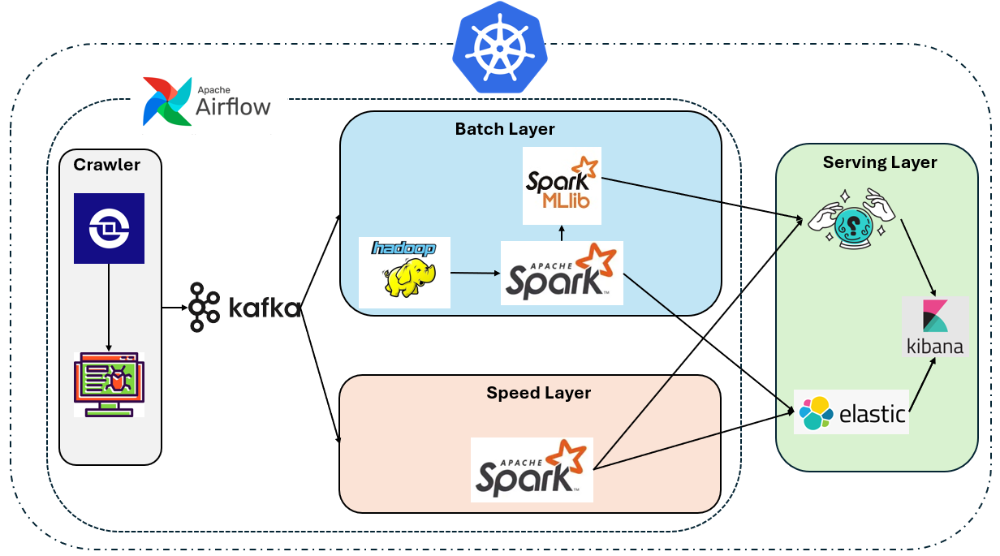
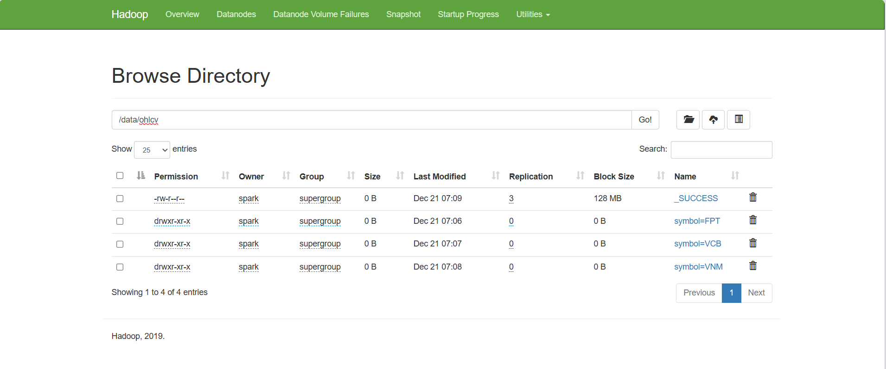
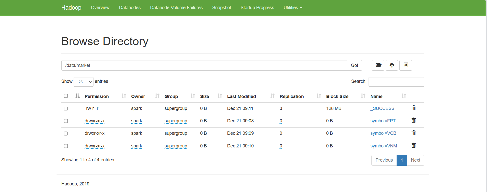

# 📈 Hệ thống Thu thập và Phân tích Dữ liệu Chứng khoán Việt Nam

> **Kiến trúc Lambda Architecture** - Xử lý song song Batch Processing & Real-time Streaming cho dữ liệu chứng khoán



---

## 🎯 Tổng quan

Hệ thống BigData thu thập, xử lý và phân tích dữ liệu chứng khoán Việt Nam theo **Lambda Architecture**, bao gồm 2 layer chính:

- **📦 Batch Layer**: Xử lý dữ liệu lịch sử (OHLCV, Market Index), tính toán chỉ số kỹ thuật, dự đoán giá bằng Machine Learning
- **⚡ Speed Layer**: Xử lý dữ liệu real-time (tick-by-tick), tổng hợp thành nến OHLCV theo thời gian thực

---

## ✨ Tính năng chính

### 1. Thu thập dữ liệu tự động
- ✅ OHLCV (Open, High, Low, Close, Volume) lịch sử và real-time
- ✅ Chỉ số thị trường (VNINDEX, HNX-INDEX)
- ✅ Dữ liệu fundamental (báo cáo tài chính, chỉ số tài chính)
- ✅ Hỗ trợ nhiều nguồn: VCI, TCBS qua thư viện **vnstock3**

### 2. Xử lý và lưu trữ
- ✅ **Kafka**: Message queue cho streaming data
- ✅ **HDFS**: Lưu trữ dữ liệu dạng Parquet với partition thông minh
- ✅ **Elasticsearch**: Index dữ liệu để truy vấn nhanh
- ✅ **Spark**: Xử lý batch và streaming data





### 3. Phân tích và chỉ số kỹ thuật
- ✅ **SMA** (Simple Moving Average)
- ✅ **EMA** (Exponential Moving Average)
- ✅ **RSI** (Relative Strength Index)
- ✅ **MACD** (Moving Average Convergence Divergence)
- ✅ **Bollinger Bands**

### 4. Machine Learning
- ✅ Dự đoán giá cổ phiếu với **Spark MLlib**
- ✅ Models: Linear Regression, Random Forest Regressor
- ✅ Evaluation: RMSE, R² Score

### 5. Orchestration
- ✅ **Airflow**: Lập lịch và quản lý workflows tự động
- ✅ **Kubernetes**: Deploy và scale hệ thống trên K8s cluster

---

## 🏗️ Kiến trúc hệ thống

```
┌─────────────────────────────────────────────────────────────────┐
│                      LAMBDA ARCHITECTURE                        │
└─────────────────────────────────────────────────────────────────┘

╔═══════════════════════╗          ╔═══════════════════════╗
║    BATCH LAYER        ║          ║    SPEED LAYER        ║
╚═══════════════════════╝          ╚═══════════════════════╝

┌──────────────────┐               ┌──────────────────┐
│  Crawler Batch   │               │  Speed Crawler   │
│  (Daily/Weekly)  │               │  (Real-time)     │
└────────┬─────────┘               └────────┬─────────┘
         │                                  │
         ▼                                  ▼
    ┌─────────────────────────────────────────┐
    │            Apache Kafka                 │
    │  Topics: stock.ohlcv.raw,              │
    │          stock.market.raw,              │
    │          stock.market.speed.raw         │
    └────────┬──────────────────┬─────────────┘
             │                  │
             ▼                  ▼
    ┌────────────────┐  ┌────────────────┐
    │ Spark Batch    │  │ Spark Streaming│
    │ (Kafka→HDFS)   │  │ (OHLCV Speed)  │
    └────────┬───────┘  └────────┬───────┘
             │                   │
             ▼                   │
    ┌────────────────┐           │
    │  HDFS Storage  │           │
    │  (Parquet)     │           │
    └────────┬───────┘           │
             │                   │
             ▼                   ▼
    ┌────────────────────────────────┐
    │  Spark Processing Jobs         │
    │  • Daily OHLCV                 │
    │  • Analyst (SMA,EMA,RSI,MACD) │
    │  • MLlib Prediction            │
    └────────┬───────────────────────┘
             │
             ▼
    ┌─────────────────────────────────┐
    │      Elasticsearch              │
    │  Indices: ohlcv_daily_v2,       │
    │           ohlcv_analysis,       │
    │           market_data_v1,       │
    │           stock_intraday        │
    └────────┬────────────────────────┘
             │
             ▼
    ┌─────────────────────────────────┐
    │   Kibana / Visualization        │
    └─────────────────────────────────┘
```

---

## 📁 Cấu trúc dự án

```
BTL_BigData/
├── airflow/                    # Airflow DAGs cho orchestration
├── batch/                      # Batch Layer (xử lý dữ liệu lịch sử)
│   ├── crawler_batch/         # Thu thập dữ liệu batch
│   └── jobs/                  # Spark jobs (Kafka→HDFS, Daily, Analyst, MLlib)
├── speed/                      # Speed Layer (xử lý real-time)
│   ├── crawler_speed/         # Thu thập dữ liệu real-time
│   └── ohlcv/                 # Tổng hợp OHLCV real-time
├── crawler/                    # Crawler độc lập (OHLCV, Fundamental, Market)
├── docker-deployment/          # Docker Compose cho local development
├── k8s-deployment/            # Kubernetes manifests cho production
│   ├── deployments/           # Deployments (Kafka, HDFS, Spark, ES, Airflow)
│   ├── services/              # Services
│   ├── jobs/                  # CronJobs
│   ├── configmap/             # ConfigMaps
│   └── secrets/               # Secrets
└── assets/                     # Hình ảnh minh họa
```

Chi tiết từng module:
- 📖 [Batch Layer README](./batch/README.md)
- 📖 [Speed Layer README](./speed/README.md)
- 📖 [Crawler README](./crawler/README.md)
- 📖 [K8s Deployment README](./k8s-deployment/README.md)

---

## 🚀 Hướng dẫn sử dụng

### Option 1: Chạy với Docker Compose (Khuyến nghị cho Development)

```bash
# Clone repository
git clone <repository-url>
cd BTL_BigData

# Chạy toàn bộ hệ thống
cd docker-deployment
docker-compose up -d

# Kiểm tra trạng thái
docker-compose ps

# Xem logs
docker-compose logs -f kafka
docker-compose logs -f spark-master

# Truy cập Web UIs:
# - HDFS NameNode: http://localhost:9870
# - Spark Master: http://localhost:8080
# - Elasticsearch: http://localhost:9200
# - Kibana: http://localhost:5601
```

### Option 2: Chạy trên Kubernetes (Production)

```bash
# Chuẩn bị K8s cluster
kubectl cluster-info

# Deploy toàn bộ hệ thống
cd k8s-deployment

# 1. Tạo namespace và config
kubectl apply -f namespace.yaml
kubectl apply -f configmap/
kubectl apply -f secrets/

# 2. Deploy infrastructure
kubectl apply -f deployments/zookeeper-deployment.yaml
kubectl apply -f services/zookeeper-service.yaml
kubectl apply -f deployments/kafka-deployment.yaml
kubectl apply -f services/kafka-service.yaml
kubectl apply -f deployments/namenode-deployment.yaml
kubectl apply -f services/namenode-service.yaml
kubectl apply -f deployments/datanode-deployment.yaml
kubectl apply -f deployments/elasticsearch-deployment.yaml
kubectl apply -f services/elasticsearch-service.yaml
kubectl apply -f deployments/spark-master-deployment.yaml
kubectl apply -f services/spark-master-service.yaml
kubectl apply -f deployments/spark-worker-deployment.yaml

# 3. Deploy batch layer
kubectl apply -f deployments/crawler-deployment.yaml
kubectl apply -f deployments/kafka-to-hdfs-ohlcv-deployment.yaml
kubectl apply -f deployments/kafka-to-hdfs-market-deployment.yaml
kubectl apply -f deployments/daily-ohlcv-deployment.yaml
kubectl apply -f deployments/analyst-ohlcv-deployment.yaml

# 4. Deploy speed layer
kubectl apply -f deployments/speed-crawler-deployment.yaml
kubectl apply -f deployments/ohlcv-speed-deployment.yaml

# Kiểm tra pods
kubectl get pods -n bigdata

# Xem logs
kubectl logs -f <pod-name> -n bigdata
```

### Option 3: Chạy từng module riêng lẻ

#### Chạy Crawler Batch:
```bash
cd batch/crawler_batch
pip install -r requirements.txt
python main.py
```

#### Chạy Spark Job:
```bash
cd batch/jobs/ohlcv/daily
spark-submit \
  --master spark://localhost:7077 \
  --packages org.elasticsearch:elasticsearch-spark-30_2.12:8.11.0 \
  daily_ohlcv.py
```

#### Chạy Speed Crawler:
```bash
cd speed/crawler_speed
pip install -r requirements.txt
python main.py
```

---

## ⚙️ Cấu hình

Các biến môi trường quan trọng (xem chi tiết trong `k8s-deployment/configmap/bigdata-config.yaml`):

```bash
# Kafka
KAFKA_BOOTSTRAP=kafka:9092
KAFKA_TOPIC_BATCH_OHLCV=stock.ohlcv.raw
KAFKA_TOPIC_BATCH_MARKET=stock.market.raw
KAFKA_TOPIC_SPEED_STOCK=stock.market.speed.raw

# HDFS
HDFS_PATH=hdfs://namenode:8020/data/ohlcv
HDFS_PATH_MARKET=hdfs://namenode:8020/data/market

# Elasticsearch
ES_HOST=http://elasticsearch:9200
ES_INDEX_BATCH_OHLCV_DAILY=ohlcv_daily_v2
ES_INDEX_BATCH_OHLCV_ANAYLYST=ohlcv_analysis
ES_INDEX_SPEED_STOCK=stock_intraday

# Spark
SPARK_MASTER=spark://spark-master:7077

# Crawler
SYMBOLS=FPT,VNM,VCB,HPG,VHM
DATA_SOURCE=VCI
START_DATE=2024-01-01
END_DATE=2024-12-31
```

---

## 📊 Dữ liệu mẫu

### OHLCV Data
```csv
symbol,trade_date,open,high,low,close,volume
FPT,2024-12-20,120.5,122.0,119.8,121.5,2500000
FPT,2024-12-21,121.5,123.5,121.0,123.0,3100000
VNM,2024-12-20,85.0,86.2,84.5,85.8,1800000
```

### Market Index Data
```csv
index_code,trade_date,open,high,low,close,volume
VNINDEX,2024-12-20,1250.5,1265.3,1248.2,1262.8,450000000
HNX-INDEX,2024-12-20,235.6,237.8,234.9,237.2,85000000
```

### Technical Indicators (Analyst Output)
```csv
symbol,trade_date,close,sma_20,ema_12,rsi_14,macd
FPT,2024-12-20,121.5,118.3,120.8,65.2,1.8
FPT,2024-12-21,123.0,119.1,121.6,68.5,2.1
```

---

## 🛠️ Tech Stack

| Component | Technology | Version |
|-----------|-----------|---------|
| **Message Queue** | Apache Kafka | 7.5.0 |
| **Storage** | Hadoop HDFS | 3.2.1 |
| **Processing** | Apache Spark | 3.x |
| **Search Engine** | Elasticsearch | 8.11.0 |
| **Orchestration** | Apache Airflow | 2.x |
| **Container** | Docker | 24.x |
| **Orchestration** | Kubernetes | 1.20+ |
| **Programming** | Python | 3.9+ |
| **Data Library** | vnstock3 | Latest |

---

## 📈 Workflow tự động

Hệ thống chạy tự động theo lịch (configure trong Airflow):

```
┌─────────────────────────────────────────────────────┐
│  Daily Schedule (2:00 AM)                           │
└─────────────────────────────────────────────────────┘

Step 1: Crawler Batch (30 mins)
  └─> Thu thập OHLCV + Market Index → Kafka

Step 2: Kafka to HDFS (15 mins)
  └─> Đọc Kafka → Ghi HDFS (Parquet)

Step 3: Daily Processing (20 mins)
  └─> HDFS → Xử lý → Elasticsearch

Step 4: Analyst Job (30 mins)
  └─> Tính SMA, EMA, RSI, MACD → Elasticsearch

Step 5: MLlib (Weekly - Sunday 3:00 AM)
  └─> Huấn luyện mô hình dự đoán
```

---

## 📝 Logs & Monitoring

### Kiểm tra Kafka topics:
```bash
kafka-topics --list --bootstrap-server kafka:9092
kafka-console-consumer --bootstrap-server kafka:9092 \
  --topic stock.ohlcv.raw --from-beginning
```

### Kiểm tra HDFS:
```bash
hdfs dfs -ls /data/ohlcv
hdfs dfs -du -h /data
```

### Query Elasticsearch:
```bash
curl http://localhost:9200/_cat/indices?v
curl http://localhost:9200/ohlcv_daily_v2/_search?size=10
```

### Spark UI:
```
http://localhost:8080  # Spark Master
http://localhost:4040  # Spark Job UI
```

---

## 🐛 Troubleshooting

**Lỗi: Kafka connection refused**
```bash
# Kiểm tra Kafka
docker ps | grep kafka
kubectl get pods -n bigdata | grep kafka
```

**Lỗi: HDFS namenode not available**
```bash
# Restart HDFS
docker-compose restart namenode
kubectl rollout restart deployment namenode -n bigdata
```

**Lỗi: Spark job failed**
```bash
# Xem logs
docker-compose logs spark-master
kubectl logs -f <spark-pod> -n bigdata
```

## 📚 Tài liệu tham khảo

- [Apache Kafka Documentation](https://kafka.apache.org/documentation/)
- [Apache Spark Documentation](https://spark.apache.org/docs/latest/)
- [Hadoop HDFS Documentation](https://hadoop.apache.org/docs/stable/)
- [Elasticsearch Documentation](https://www.elastic.co/guide/en/elasticsearch/reference/current/index.html)
- [vnstock3 Documentation](https://vnstock.site/)
- [Apache Airflow Documentation](https://airflow.apache.org/docs/)
